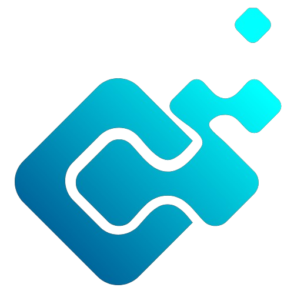
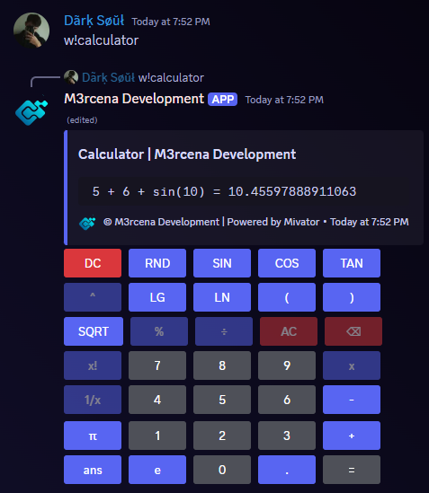

<p align="center">
    
</p>
<h1 align="center">Weky</h1>
<p style="font-size:16px"><b>A fun npm package to play games within Discord with buttons!</b></p>
<br>
<p align="center">
    
    
    <br>
    <a href="https://www.npmjs.com/package/@m3rcena/weky">
      
    </a>
    <a href="https://www.npmjs.com/package/@m3rcena/weky">
      
    </a>
    <a href="https://m3rcena.gitbook.io/m3rcena-weky">
      
    </a>
    <br>
    <a href="https://www.npmjs.com/package/@m3rcena/weky"></a>
</p>
<br><br>

# Install

Latest stable Version: **`v10.1.0`**

<details><summary>👉 via NPM</summary>

```bash
npm install --save @m3rcena/weky
```

</details>

# Documentation
Check out the [Documentation](https://m3rcena.gitbook.io/docs)

# Used in:
<a href="https://discord.com/users/1068868597398650971/"></a>

# Features
- 🧑 Beginner friendly

- 🎉 Easy to use

- 🔘 Discord Buttons

- 🤖 Supports Discord.js v14

- ✂ Fully Customizable

- and much more!

# Usage 📚

<details><summary>👉 CommonJS</summary>

```js
const { Client, GatewayIntentBits } = require("discord.js");

const { WekyManager }= require("@m3rcena/weky");

const client = new Client({
    intents: [
        GatewayIntentBits.Guilds,
        GatewayIntentBits.GuildMessages,
        GatewayIntentBits.MessageContent,
    ]
});

client.on("ready", async (cl) => {
    console.log("Bot is ready");
    client.wekyManager = new WekyManager(cl); // Initialize Weky Manager
});

client.on("messageCreate", async (message) => {
    if (message.author.bot) return;
    if (message.content === "w!calculator") {
        client.wekyManager.createCalculator({
            interaction: message,
            client: client,
            embed: {
                color: "Blurple",
                title: "Calculator | M3rcena Development",
                timestamp: new Date(),
            }
        })
    };
});

client.login('Your bot Token');
```

</details>

<details><summary>👉 ESM (Module)</summary>

```ts
import { Client, GatewayIntentBits } from "discord.js";

import { WekyManager } from "@m3rcena/weky";

export interface ExtendedClient extends Client {
    wekyManager: WekyManager;
};

const client = new Client({
    intents: [
        GatewayIntentBits.Guilds,
        GatewayIntentBits.GuildMessages,
        GatewayIntentBits.MessageContent,
    ]
}) as ExtendedClient;

client.on("ready", async (cl) => {
    console.log("Bot is ready");
    client.wekyManager = new WekyManager(cl); // Initialize Weky Manager
});

client.on("messageCreate", async (message) => {
    if (message.author.bot) return;
    if (message.content === "w!calculator") {
        client.wekyManager.createCalculator({
            interaction: message,
            client: client,
            embed: {
                color: "Blurple",
                title: "Calculator | M3rcena Development",
            }
        })
    };
});

client.login("Your bot token");
```

</details>

# Result 📤


# Contributing 🤝
- Contributions, issues and feature requests are welcome!
- Feel free to check [issues page](https://github.com/M3rcena/m3rcena-weky/issues)

# Support ❔
<iframe src="https://discord.com/widget?id=1224358764463783987&theme=dark" width="350" height="350" allowtransparency="true" frameborder="0" sandbox="allow-popups allow-popups-to-escape-sandbox allow-same-origin allow-scripts"></iframe>

# Developers 👨‍💻
<a href="https://discord.com/users/682983233851228161/"></a>

# Contributors
<a href="https://discord.com/users/498094279793704991/"></a><br>
<a href="https://discord.com/users/1139406664584409159/"></a><br>
<a href="https://discord.com/users/1072592763427754034/"></a>