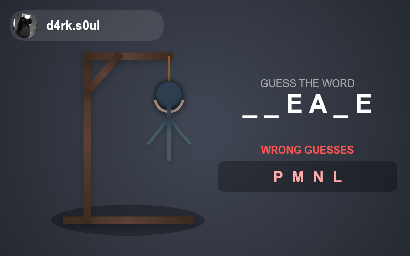

<div align="center">
  
  <h1>@m3rcena/weky</h1>
  <p><b>The ultimate game engine for Discord bots.</b></p>
  <p>Build engaging, interactive, and button-based games within minutes.</p>

  <p>
    <a href="https://www.npmjs.com/package/@m3rcena/weky">
      
    </a>
    <a href="https://www.npmjs.com/package/@m3rcena/weky">
      
    </a>
    <a href="https://discord.gg/U4E2Pn2wyn">
      
    </a>
  </p>
  <p>
    
    
  </p>
</div>

---

## ⚡ Features

- **Discord.js v14 Ready:** Built to support the latest Discord features.
- **Dual Support:** Works flawlessly with both **Slash Commands** (`/`) and **Legacy Messages** (`w!`).
- **Plug & Play:** Zero complex setup. Initialize the manager and start a game.
- **Fully Customizable:** Change embed colors, titles, buttons, and more.
- **TypeScript Support:** Written in TypeScript for robust type-safety.

## 📦 Installation

```bash
npm install @m3rcena/weky
```

## 🚀 Quick Start

### 1. Initialize the Manager

You only need to do this once in your main bot file.

```typescript
const { Client, GatewayIntentBits } = require("discord.js");
const { WekyManager } = require("@m3rcena/weky");

const client = new Client({
	intents: [GatewayIntentBits.Guilds, GatewayIntentBits.GuildMessages, GatewayIntentBits.MessageContent],
});

client.on("ready", (c) => {
	console.log(`✅ ${c.user.tag} is online!`);
	// Initialize Weky
	client.wekyManager = new WekyManager(c);
});

client.login("YOUR_BOT_TOKEN");
```

### 2. Create a Game

Here is how to run a game using the new `context` system, which supports both Slash Commands and Messages automatically.

#### 🟢 Calculator Example

```javascript
// Works in 'messageCreate' OR 'interactionCreate'
await client.wekyManager.createCalculator({
	context: interaction, // or 'message'
	embed: {
		title: "Calculator | M3rcena",
		color: "Blurple",
		timestamp: new Date(),
	},
});
```

#### 🔴 Fight Example

```javascript
// Works in 'messageCreate' OR 'interactionCreate'
await client.wekyManager.createFight({
	context: interaction, // or 'message'
	opponent: targetUser, // The User object of the opponent
	embed: {
		title: "Fight Arena",
		color: "Red",
		timestamp: new Date(),
	},
});
```

## 🎮 Available Games

| Game                  | Function                      | Description                              |
| :-------------------- | :---------------------------- | :--------------------------------------- |
| **2048**              | `create2048`                  | The classic sliding tile puzzle.         |
| **Calculator**        | `createCalculator`            | A fully functional GUI calculator.       |
| **Fight**             | `createFight`                 | Turn-based combat system.                |
| **Guess The Number**  | `createGuessTheNumber`        | Guess a number within a range.           |
| **Will You Press?**   | `createWillYouPressTheButton` | Hard choices with percentage stats.      |
| **Snake**             | `createSnake`                 | The retro snake game on Discord buttons. |
| **...and many more!** |                               | Check docs for the full list.            |

## 📸 Previews

<div align="center">
  
  
  
</div>

## 📚 Documentation

Need more details? Check out our full documentation for advanced usage and config options.

[](https://m3rcena.github.io/WekyDashboard/docs/installation)

## 🤝 Support & Community

Running into issues? Join our Discord server for help.

<a href="https://discord.gg/U4E2Pn2wyn">
  
</a>

## 💻 Developers

<a href="https://github.com/M3rcena">
  
</a>

---

<p align="center">
  Made with ❤️ in Greece
</p>
