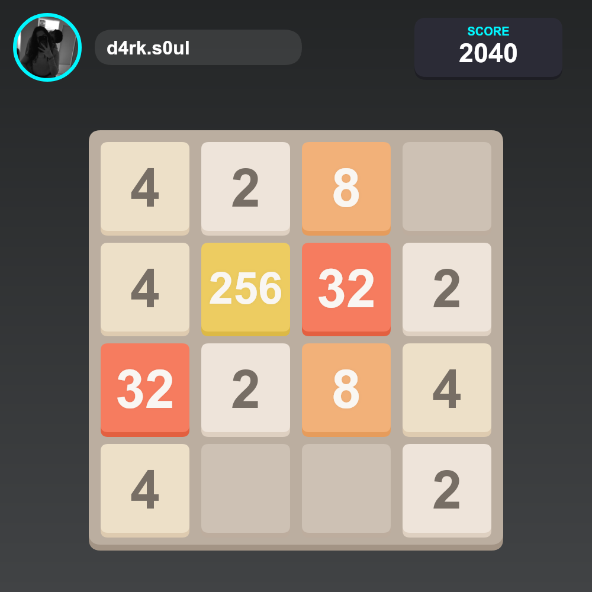

<div align="center">
  
  <h1>@m3rcena/weky</h1>
  <h3>The Modern Discord.js v14 Game Engine</h3>
  <p>
    <b>Strictly Typed. Crash Proof. Maintenance First.</b><br>
    The spiritual successor to the original `weky`, rewritten for modern bots.
  </p>

  <p>
    <a href="https://www.npmjs.com/package/@m3rcena/weky">
      
    </a>
    <a href="https://www.npmjs.com/package/@m3rcena/weky">
      
    </a>
    <a href="https://discord.gg/U4E2Pn2wyn">
      
    </a>
  </p>
  <p>
    
    
    
  </p>
</div>

---

## 🚨 Why use this over the old `weky`?

The original `weky` library is legendary, but it is **no longer maintained** and breaks on Discord.js v14 due to changes in the Interaction API.

| Feature | ❌ Old `weky` | ✅ @m3rcena/weky |
| :--- | :--- | :--- |
| **Discord.js Support** | v12 / v13 | **v14 (Latest)** |
| **Type Safety** | ⚠️ Loose / Any | **🛡️ 100% Strict TypeScript** |
| **Interaction Handling**| ❌ Crashes often | **✅ Auto-detects Slash/Message** |
| **Maintenance** | 💀 Abandoned | **🚀 Active Development** |

---

## ⚡ Features

- **Discord.js v14+ Native:** Built specifically to handle the new `Interaction` and `Button` systems without crashing.
- **Hybrid Context:** One function works for both **Slash Commands** (`/`) and **Legacy Messages** (`!`).
- **Zero "Any" Types:** Full intellisense support in VS Code.
- **Plug & Play:** No complex setup or databases required.
- **Fully Customizable:** Change button styles, embed colors, texts, and timeouts.

## 📦 Installation

```bash
npm install @m3rcena/weky
# or
yarn add @m3rcena/weky
# or
pnpm add @m3rcena/weky
```

## 🚀 Quick Start (TypeScript / ESM)

### 1. Initialize the Manager

```typescript
import { Client, GatewayIntentBits } from "discord.js";
import { WekyManager } from "@m3rcena/weky";

const client = new Client({
  intents: [
    GatewayIntentBits.Guilds,
    GatewayIntentBits.GuildMessages,
    GatewayIntentBits.MessageContent
  ],
});

client.on("ready", (c) => {
  console.log(`✅ ${c.user.tag} is online!`);
  // Initialize Weky with your client
  client.wekyManager = new WekyManager(c);
});

client.login("YOUR_BOT_TOKEN");
```

### 2. Create a Game

Our new `context` system automatically detects if the command was sent via Slash Command or standard message.

#### 🟢 Calculator (Modern Usage)
```typescript
import { CommandInteraction, Message } from "discord.js";

// Inside your command handler
export async function run(interaction: CommandInteraction | Message) {
    await client.wekyManager.createCalculator({
        context: interaction, 
        embed: {
            title: "Calculator | M3rcena",
            color: "Blurple", 
            timestamp: new Date(),
        },
        disabledQuery: "Calculator is disabled!",
        invalidQuery: "The provided equation is invalid!",
        othersMessage: "Only <@{{author}}> can use the buttons!",
    });
}
```

## 🎮 Available Games

| Game | Function | Status |
| :--- | :--- | :--- |
| **2048** | `create2048` | ✅ Stable |
| **Calculator** | `createCalculator` | ✅ Stable |
| **Fight** | `createFight` | ✅ Stable |
| **Guess The Number** | `createGuessTheNumber` | ✅ Stable |
| **Will You Press?** | `createWillYouPressTheButton`| ✅ Stable |
| **Snake** | `createSnake` | ✅ Stable |
| **Rock Paper Scissors**| `createRPS` | ✅ Stable |

## 📸 See it in Action

> **Tip:** Games are fully interactive using Discord Buttons.

<div align="center">
  
  
</div>

## 📚 Documentation

Need advanced customization? Check our full docs for button styling, custom messages, and timeout handling.

[](https://m3rcena.github.io/WekyDashboard/docs/installation)

## 🤝 Support & Community

Found a bug? Have a game request? Join the support server.

<a href="https://discord.gg/U4E2Pn2wyn">
  
</a>

## 💻 Developers

<a href="https://github.com/M3rcena">
  
</a>

---

<p align="center">
  Made with ❤️ in Greece
</p>